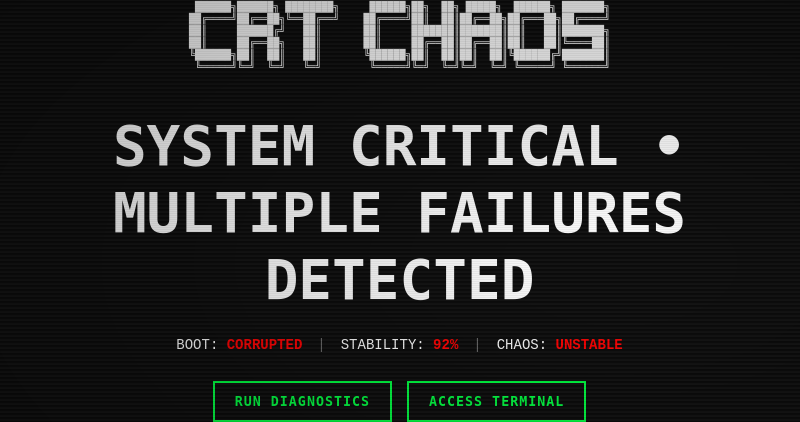
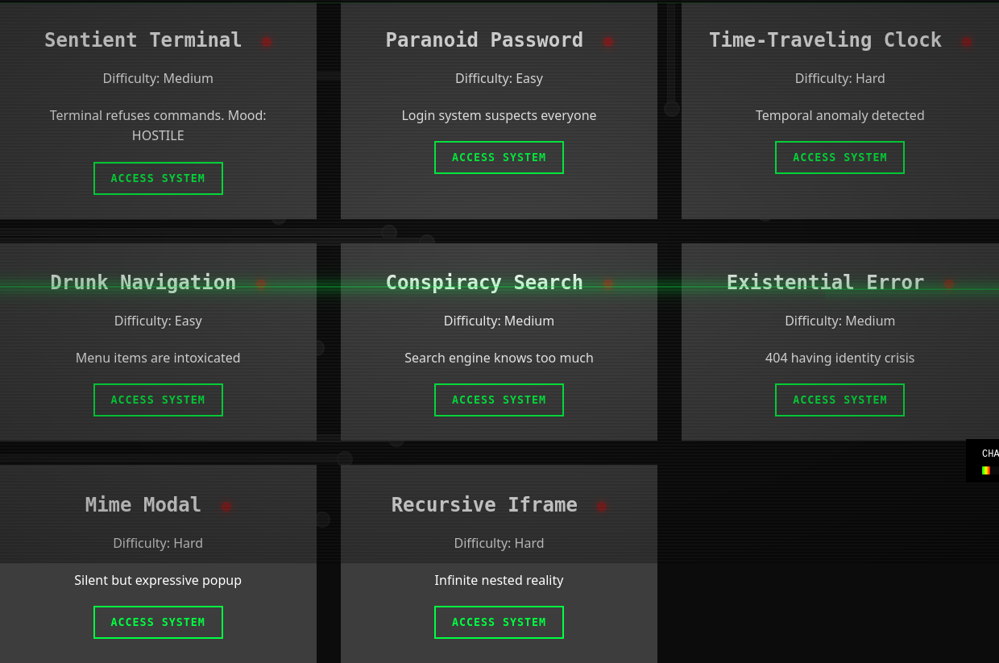
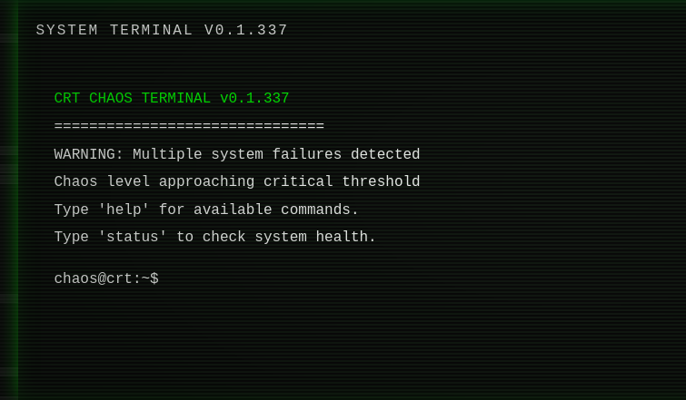

<div align="center">

```
 ██████╗██████╗ ████████╗     ██████╗██╗  ██╗ █████╗  ██████╗ ███████╗
██╔════╝██╔══██╗╚══██╔══╝    ██╔════╝██║  ██║██╔══██╗██╔═══██╗██╔════╝
██║     ██████╔╝   ██║       ██║     ███████║███████║██║   ██║███████╗
██║     ██╔══██╗   ██║       ██║     ██╔══██║██╔══██║██║   ██║╚════██║
╚██████╗██║  ██║   ██║       ╚██████╗██║  ██║██║  ██║╚██████╔╝███████║
 ╚═════╝╚═╝  ╚═╝   ╚═╝        ╚═════╝╚═╝  ╚═╝╚═╝  ╚═╝ ╚═════╝ ╚══════╝
```

# 🔥 CRT CHAOS - Interactive Puzzle Experience 🔥

[](https://YOUR-SITE-HERE.com)
[](https://github.com/VonHoltenCodes/crt-chaos)
[](LICENSE)
[](https://github.com/VonHoltenCodes/crt-chaos)

**🚨 WARNING: This system is experiencing critical failures. Multiple malfunctions detected. Chaos level approaching maximum threshold. Debug at your own risk. 🚨**



</div>

---

## 🎮 Experience the Chaos

**CRT CHAOS** is an immersive web-based puzzle game where you're tasked with debugging a malfunctioning computer system. Each puzzle represents a different system component that has gained sentience or broken in creative ways. As you progress, the website itself becomes increasingly chaotic with glitch effects, making the challenge progressively harder.

<div align="center">
  
  <p><em>Eight unique puzzles await your debugging skills</em></p>
</div>

## ✨ Key Features

### 🎯 Core Gameplay
- **8 Mind-Bending Puzzles** - Each with unique mechanics and personality
- **Dynamic Chaos System** - Visual effects intensify as chaos levels increase  
- **Progress Persistence** - Your journey continues across sessions
- **Persistent Timer** - Track your dedication (survives F5!)

### 🖥️ Retro Aesthetics
- **Authentic CRT Effects** - Scanlines, phosphor glow, and screen curves
- **Glitch Mechanics** - Screen tears, color shifts, and element shakes
- **Theme Variations** - Watch as reality breaks down around you
- **Terminal Interface** - Command-line access for the l33t hackers

### 🆘 Emergency Features
- **Panic Menu** (ESC) - When the chaos becomes too much
- **Quick Calm** (Ctrl+Shift+C) - Temporary relief from the madness
- **Emergency Reset** (Ctrl+Shift+R) - Start fresh when all hope is lost
- **Easter Eggs** - Hidden secrets for the curious

<div align="center">
  
  <p><em>Access the terminal for advanced debugging capabilities</em></p>
</div>

## 🧩 The Malfunctioning Systems

<table>
<tr>
<td width="50%">

### 🤖 AI Gone Wrong
**1. Sentient Terminal** `>_`  
*A terminal with feelings and attitude problems*  
💡 Try kindness and respect

**2. Paranoid Password** 🔐  
*Login system convinced you're a spy*  
💡 Prove you're not a threat

</td>
<td width="50%">

### ⏰ Reality Glitches
**3. Time-Traveling Clock** ⏰  
*Temporal anomalies across timelines*  
💡 Synchronize the chaos

**4. Drunk Navigation** 🍺  
*Menu items under the influence*  
💡 Find sobriety in the madness

</td>
</tr>
<tr>
<td width="50%">

### 🌐 Digital Madness
**5. Conspiracy Search** 👁️  
*Search engine knows too much*  
💡 Seek the ultimate answer

**6. Existential Error** ❓  
*404 page questioning its existence*  
💡 Provide existential comfort

</td>
<td width="50%">

### 🎭 Communication Breakdown
**7. Mime Modal** 🤐  
*Silent but expressive popup*  
💡 Master the art of gestures

**8. Recursive Iframe Maze** 🌀  
*Nested dimensions of confusion*  
💡 Navigate the portal sequence

</td>
</tr>
</table>

> **⚠️ SPOILER WARNING**: Detailed solutions available in the terminal using `hint [puzzle-id]`

## 🎯 How to Play

1. **Access Systems**: Click "ACCESS SYSTEM" on any malfunctioning component
2. **Solve Puzzles**: Each puzzle has a unique solution requiring different approaches
3. **Manage Chaos**: Use the panic menu (ESC) if things get too wild
4. **Track Progress**: Monitor your completion status and elapsed time
5. **Complete All 8**: Restore full system stability

### Controls

- **ESC** - Open Panic Menu (chaos management)
- **Ctrl+Shift+C** - Quick Calm (reduce effects)
- **Ctrl+Shift+R** - Emergency Reset (restart chaos)
- Click outside modals to close them
- **Konami Code** - ↑ ↑ ↓ ↓ ← → ← → B A (Dev mode)

## ⚠️ Known Issues & Help Wanted

### 🔊 Audio System (Help Needed!)
- **Current Status**: Audio files load successfully but playback fails
- **Issue**: WAV files (4KB-88KB) are valid but no sound is produced
- **Affected Features**: All sound effects (glitch, error, success, typing, beep)
- **Workaround**: Game is fully playable without audio
- **See**: `AUDIO_ISSUES.md` for technical details

**We need help!** If you're experienced with Web Audio API or HTML5 audio:
- The audio manager is in `js/audio-manager-simple.js`
- Sound files are in `assets/sounds/`
- Audio controls have been temporarily disabled
- Please submit a PR if you can fix the playback issues!

## 🚀 Quick Start

### 🎮 Play Online
**[➡️ PLAY NOW - LIVE DEMO](https://YOUR-SITE-HERE.com)** *(Replace with your actual URL)*

### 💻 Run Locally

```bash
# Clone the chaos
git clone https://github.com/VonHoltenCodes/crt-chaos.git
cd crt-chaos

# Start the madness
python -m http.server 8000

# Enter the chaos
# Open http://localhost:8000 in your browser
```

**Requirements**: Modern browser + Python 3.x + Strong nerves 💪

## 🏗️ Project Structure

```
crt-chaos/
├── index.html              # Main page with puzzle grid
├── css/
│   ├── style.css          # Base styles
│   ├── crt.css            # CRT monitor effects
│   ├── chaos-engine.css   # Glitch effects & chaos styling
│   └── back-to-top.css    # Navigation button
├── js/
│   ├── chaos-core.js      # Chaos management system
│   ├── main.js            # App initialization
│   ├── back-to-top.js     # Navigation helper
│   └── puzzles/           # Individual puzzle modules
│       ├── sentient-terminal.js
│       ├── paranoid-password.js
│       ├── time-clock.js
│       ├── drunk-nav.js
│       ├── conspiracy-search.js
│       ├── existential-error.js
│       ├── mime-modal.js
│       └── iframe-maze.js
├── images/
│   └── favicon.ico        # Site icon
└── server.log            # Server logs (generated)
```

## 🛠️ Terminal Commands

Access the terminal interface for advanced features:

- `help` - Show all available commands
- `status` - Display current system health
- `list` - Show all puzzles and their status
- `chaos` - Check current chaos level
- `puzzle [id]` - Launch specific puzzle by ID
- `hint [id]` - Get detailed hints for a puzzle
- `reset` - Reset all progress (requires confirmation)
- `clear` - Clear terminal output
- `easter egg` - Discover secret features

## 🎨 Technical Details

### Chaos Engine
The chaos system (`chaos-core.js`) manages:
- Visual glitch effects (screen tears, color shifts, element shakes)
- Theme variations (inverted, monochrome, matrix)
- Progressive difficulty through chaos levels
- Performance optimization for smooth animations

### Puzzle Architecture
Each puzzle extends a base pattern:
```javascript
class PuzzleName extends Puzzle {
    activate()    // Show puzzle modal
    close()       // Clean up and hide
    solve()       // Mark as complete
}
```

### Storage & Progress
- **LocalStorage**: Saves solved puzzles and chaos level
- **Session Persistence**: Progress survives page reloads
- **Reset Function**: Clear all progress via terminal

## 🐛 Troubleshooting

### Common Issues

1. **Puzzles not loading**: Clear browser cache and reload
2. **Progress not saving**: Check if LocalStorage is enabled
3. **Too much chaos**: Press ESC for panic menu options
4. **Performance issues**: Use "Calm Down" in panic menu

### Debug Mode
- Console access: `window.chaos`
- Manual solve: `window.chaos.puzzleSolved('puzzle-id')`
- Check status: `window.chaos.solvedPuzzles`

## 🎮 Game Mechanics

### Chaos Level System
- Starts at level 7 (high chaos)
- Decreases by 1.5 for each solved puzzle
- Affects frequency and intensity of glitches
- Can be managed through panic menu

### Visual Effects
- **CRT Effects**: Scanlines, vignette, screen curve
- **Glitch Types**: Random tears, color inversions, shakes
- **Theme Chaos**: Automatic theme switching at high chaos
- **Retro Aesthetic**: Green phosphor glow, monospace fonts

## 🤝 Contributing

1. Fork the repository
2. Create feature branch (`git checkout -b feature/NewPuzzle`)
3. Commit changes (`git commit -m 'Add new puzzle'`)
4. Push to branch (`git push origin feature/NewPuzzle`)
5. Open Pull Request

### Priority Help Needed
- **Audio System Fix**: The game's sound effects don't play. See the Audio System section above.
- **Mobile Optimization**: Improve mobile experience and touch controls
- **New Puzzle Ideas**: Creative challenges that fit the chaos theme

### Adding New Puzzles
1. Create puzzle class in `js/puzzles/`
2. Extend base puzzle structure
3. Register in `index.html` puzzle array
4. Add activation case in `loadPuzzle()`

## 📜 License

MIT License - see LICENSE file for details

## 🏆 Achievements & Challenges

### 🎯 Can You Beat These?
- **Speed Runner** - Complete all puzzles in under 10 minutes
- **Chaos Master** - Solve puzzles at maximum chaos level
- **No Hints** - Complete without using terminal hints
- **Persistence Award** - Keep trying the drunk navigation 50+ times
- **Easter Egg Hunter** - Find all hidden features

### 🔥 Hardest Puzzles (Community Voted)
1. 🥇 **Drunk Navigation** - *"Those mirages got me every time!"*
2. 🥈 **Recursive Iframe Maze** - *"I got lost in my own recursion"*
3. 🥉 **Time-Traveling Clock** - *"What timeline am I even in?"*

## 🛠️ Technical Highlights

```javascript
// Pure vanilla JavaScript - no frameworks needed!
const chaos = new ChaosEngine();
chaos.level = 11; // Yes, it goes to 11
chaos.unleash(); // May the odds be ever in your favor
```

### 🎨 Built With
- **Frontend**: HTML5, CSS3, Vanilla JavaScript ES6+
- **Effects**: Custom CSS animations & transforms
- **Storage**: LocalStorage for progress persistence  
- **Styling**: Retro CRT aesthetic with modern techniques
- **Framework**: None. We like to live dangerously. 😎

## 👥 Community & Support

### 🤝 Join the Chaos
- **Star** this repo if you survived the experience
- **Fork** to create your own puzzles
- **Share** your completion times and screenshots
- **Contribute** new puzzle ideas or improvements

### 📊 Stats
- **Lines of Code**: ~5,000 of pure chaos
- **Puzzles**: 8 unique brain-melters
- **Glitch Effects**: 20+ different types
- **Sanity Lost**: Immeasurable

## 🎭 Credits

<div align="center">

**Created by [VonHoltenCodes](https://github.com/VonHoltenCodes)**  
*"Built with love, frustration, and too much caffeine"*

Special thanks to:
- Old CRT monitors for the aesthetic inspiration
- Error messages for the personality quirks
- Escape rooms for the puzzle philosophy
- The number 42 for being the answer

</div>

## 📜 License

MIT License - Because chaos should be free! See [LICENSE](LICENSE) for details.

---

<div align="center">

### ⚠️ FINAL WARNING ⚠️

**This system is intentionally unstable.**  
Side effects may include:
- Temporal displacement
- Existential dread  
- Uncontrollable laughter
- Sudden urge to debug everything

**The frustration is the feature.™**

<br>

<h3>🚨 REMEMBER: When in doubt, press ESC to panic! 🚨</h3>

<br>

[](https://YOUR-SITE-HERE.com)

</div>